<!-- Header Heading & Dynamic Typing Animation -->
<h1 align="center">Hi there, I'm Prateek Singh Bisht 👋</h1>

<p align="center">
  <a href="https://git.io/typing-svg">
    
  </a>
</p>

<!-- Profile Views & Social Badges -->
<p align="center">
  
  &nbsp;
  <a href="https://www.linkedin.com/in/prateek-singh-bisht-4868742b9" target="_blank">
    
  </a>
  &nbsp;
  <a href="https://bishtprateek270-hue.github.io/Portfolio/" target="_blank">
    
  </a>
  &nbsp;
  <a href="mailto:bishtprateek270@gmail.com">
    
  </a>
</p>

---

## ⚡ About Me

```yaml
name: Prateek Singh Bisht
location: Delhi, India
education: 3rd Year B.Tech in AI & Machine Learning @ PIET (2024 to 2028)
focus: Full-Stack Engineering, Multimodal Vision, RAG Architectures, ML Systems
status: Shipping production web platforms & open-source projects
```

- 🧠 **AI & Machine Learning**: Designing end-to-end vision pipelines, source-grounded RAG architectures, and intelligent web platforms.
- 🏗️ **Full-Stack Architecture**: Passionate about bridging bleeding-edge AI models (Gemini Vision, LLM Tool Calling, Vector Search) with high-performance web frontends and asynchronous backends.
- 🏆 **Hackathons & Competitions**: Active participant in national hackathons (Smart India Hackathon Finalist, COER Manthan, Hack KRMU).
- ☕ **Work Philosophy**: Build resilient architectures, write clean maintainable code, and solve genuine user problems.

---

## 🛠️ Tech Arsenal & Stack

<p align="center">
  <br/>
  <br/>
  
</p>

### 💻 Core Capabilities

| Domain | Stack & Technologies |
| :--- | :--- |
| **Languages** | Python, C++, C, TypeScript, JavaScript, SQL |
| **AI, Vision & Systems** | Gemini 2.5/Pro Multimodal Vision, LLM Integration, Vector Embeddings, RAG Architectures, OpenCV, PyTorch |
| **Web & Frameworks** | Next.js 16, React 19, FastAPI, Flask, Streamlit, Three.js, Deck.gl, Tailwind CSS, Vite |
| **Databases & DevOps** | PostgreSQL, SQLite, MongoDB, Firebase, Docker, Git, Vercel, Render |
| **Engineering Practices** | System Architecture, RESTful APIs, Asynchronous I/O, Data Structures & Algorithms, Clean OOP |

---

## 🚀 Featured Projects

<table>
<tr>
<td width="50%" valign="top">

### ✨ [KarigarAI](https://karigar-ai-amber.vercel.app/) — Artisan AI Commerce Platform
> **React 19 · FastAPI · Python · Gemini Vision · WhatsApp Commerce**

Full-stack marketplace empowering Indian artisans with vision AI catalog generation, fair pricing calculators, cultural story synthesis, and direct WhatsApp commerce integration.

🔗 **[Live Demo](https://karigar-ai-amber.vercel.app/)** &nbsp;|&nbsp; 🐙 **[GitHub Repo](https://github.com/bishtprateek270-hue/karigarAI)**

</td>
<td width="50%" valign="top">

### 🔍 [RAGMind](https://ai-rag-platform-sigma.vercel.app/) — Source-Grounded Document AI
> **Next.js 16 · FastAPI · Python · TypeScript · SQLite · Vector Search**

Enterprise document intelligence platform indexing multi-format documents (`.pdf`, `.docx`, `.pptx`). Provides interactive Q&A with exact page citation overlays, automated flashcards, and summary exports.

🔗 **[Live Demo](https://ai-rag-platform-sigma.vercel.app/)**

</td>
</tr>
<tr>
<td width="50%" valign="top">

### 🌐 [3D-ULPIN MVP](https://3-d-ulpin-mvp.vercel.app/) — 3D Cadastral & Digital Twin Engine
> **React · TypeScript · FastAPI · Deck.gl · Three.js · Gemini Vision**

Volumetric cadastral digital twin modernizing land records into multi-layer 3D parcel envelopes with AI architectural spatial inspection and subsurface utility mapping.

🔗 **[Live Demo](https://3-d-ulpin-mvp.vercel.app/)** &nbsp;|&nbsp; 🐙 **[GitHub Repo](https://github.com/harsh3011dev-oops/3D-ULPIN-MVP)**

</td>
<td width="50%" valign="top">

### 📄 [AI Resume Analyzer](https://resume-analyzer-nejevwpy2bcvrvuag9schr.streamlit.app/) & ATS Optimizer
> **Python · Streamlit · Gemini 2.5 Flash · PostgreSQL · ReportLab**

Intelligent career tool parsing PDF resumes and calculating ATS match scores against target job descriptions with qualitative gap analysis and PDF exports.

🔗 **[Live Demo](https://resume-analyzer-nejevwpy2bcvrvuag9schr.streamlit.app/)**

</td>
</tr>
<tr>
<td width="50%" valign="top">

### 📚 [ShikshaSetu](https://shikshasetu-ten.vercel.app/) — AI EdTech Platform
> **Next.js · TypeScript · Firebase · Gemini Pro / Vision API**

Adaptive educational workspace featuring automated structured notes generation, PDF-to-quiz synthesis, and intelligent doubt resolution.

🔗 **[Live Demo](https://shikshasetu-ten.vercel.app/)**

</td>
<td width="50%" valign="top">

### 💳 [SimplePay](https://simplepay-946w.onrender.com/) — 3-Tier Payment Dashboard
> **React SPA · Flask REST API · MongoDB · Docker**

Containerized 3-tier financial dashboard with interactive React SPA frontend, Flask REST API backend, MongoDB persistence, and Docker deployment.

🔗 **[Live Demo](https://simplepay-946w.onrender.com/)**

</td>
</tr>
</table>

---

## 📈 Activity & Contribution Analytics

<p align="center">
  
</p>

<!-- Contribution Activity Graph -->
<p align="center">
  
</p>

<!-- Snake Contribution Animation -->
<h3 align="center">🐍 Contribution Stream</h3>
<p align="center">
  <picture>
    <source media="(prefers-color-scheme: dark)" srcset="./assets/github-snake-dark.svg" />
    <source media="(prefers-color-scheme: light)" srcset="./assets/github-snake.svg" />
    
  </picture>
</p>

---

## 💼 Experience & Education

<table>
<tr>
<td width="50%" valign="top">

### 🧪 Work Experience

**Data Science & Machine Learning Intern**  
*The Brainhub · Jul 2024 – Aug 2024*
- Developed end-to-end data processing and feature engineering pipelines.
- Implemented predictive ML models and validation workflows.
- Collaborated across agile development cycles.

</td>
<td width="50%" valign="top">

### 🎓 Education & Certifications

**B.Tech in AI & Machine Learning**  
*Panipat Institute of Engineering & Technology (PIET) · 2024 – 2028*
- Sem 1: **7.95 SGPA** · Sem 2: **8.21 SGPA** · Sem 3: **7.30 SGPA**

**C Programming Certification**  
*IIT Bombay Spoken Tutorial Project · 85% Score (Dec 2024)*

</td>
</tr>
</table>

---

## 🏆 Hackathons & Honors

| Event | Organization / Venue | Distinction |
| :--- | :--- | :--- |
| **Smart India Hackathon (SIH) 2025** | Ministry of Education / PIET | College Level Finalist |
| **COER Manthan '25** | COER University | National Finalist |
| **Hack KRMU 5.0** | K.R. Mangalam University | Hackathon Participant |
| **LogoLocha 2025** | SKLZ TECT | Design & Brand Identity |

---

<p align="center">
  <a href="https://git.io/typing-svg">
    
  </a>
</p>
